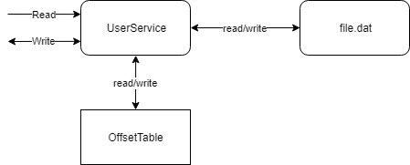
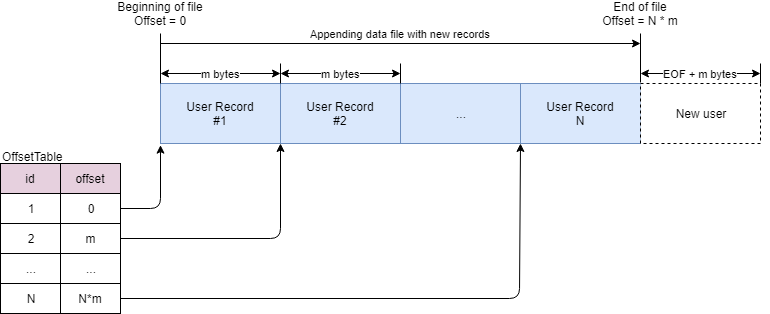

# Параллельный сервис

Реализовать класс, который должен предоставлять сервис по сохранению и чтению записей с информацией о пользователе. Сервис должен уметь сохранять внутреннее состояние в файл и поддерживать многопоточную работу.

Тип приложения - консольное, сервис реализуется как класс или набор классов. Доступ к сервису должен осуществляться из разных потоков консольного приложения.


## Интерфейс сервиса

Класс сервиса должен поддерживать 2 операции - чтение из сервиса и запись в сервис:
* Add - добавление нового пользователя в сервис.
* Get - поиск пользователя по *userId*.

```csharp
class IUserService
{
	void Add(User user);

	User Get(int userId);
}
```

Данные о пользователе сервис должен передавать в классе _User_:
* Id - идентификатор пользователя, задается пользователем сервиса.
* FirstName - имя пользователя.
* LastName - фамилия пользователя.
* BirthDate - дата рождения пользователя.

```csharp
class User
{
	public int Id { get; set; }

	public string FirstName { get; set; }

	public string LastName { get; set; }

	public DateTime BirthDate { get; set; }

	// ...
}
```

Добавьте еще 3-4 поля разных типов.


## Работа сервиса




### Хранилище



Сервис должен использовать файл file.dat в качестве хранилища. Единицей хранилища выступает запись фиксированного размера, строковые значения (FirstName и LastName) должны быть ограничены по размеру. Размеры (типы) полей записи и лимиты на строки выберите самостоятельно.

Пример

| Name      | Type   | Size (in bytes) |
|-----------|--------|-----------------|
| Id        | int32  | 4               |
| FirstName | char[] | 60              |
| LastName  | char[] | 60              |
| BirthDate | int64  | 8               |


### Таблица OffsetTable

Для облегчения поиска записей, сервис должен поддерживать таблицу OffsetTable - в таблице должны содержаться кортежи (Id, Offset). Offset - это смещение 


### Добавление пользователя

Добавление пользователя осуществляется вызовом метода Add:
1. Если user == null, то генерируется исключение ArgumentNullException.
2. Если запись с указанным Id уже добавлен в хранилище, то генерируется пользовательское исключение UserExistsException (создать самостоятельно).
3. Сервис добавляет новую запись в конец файла и обновляет таблицу OffsetTable.


### Возврат пользователя

Поиск пользователя осуществляется по идентификатору с помощью метода Get, который возвращает:
* класс User с данными о пользователе, если пользователь с указанным Id существует в хранилище.
* null, если пользователь с указанным Id отсутствует в хранилище.


### Многопоточная работа

Сервис должен поддерживать многопоточную работу методов Add и Get.
1. Реализуйте механизм защиты сервиса с помощью операции lock.
2. Реализуйте механизм защиты сервиса с помощью класса ReaderWriterLockSlim.


### Восстановление состояния

Сервис должен поддерживать восстановление состояния. Во время старта, сервис должен определить, существует ли файл file.dat, открыть его и заполнить таблицу OffsetTable.